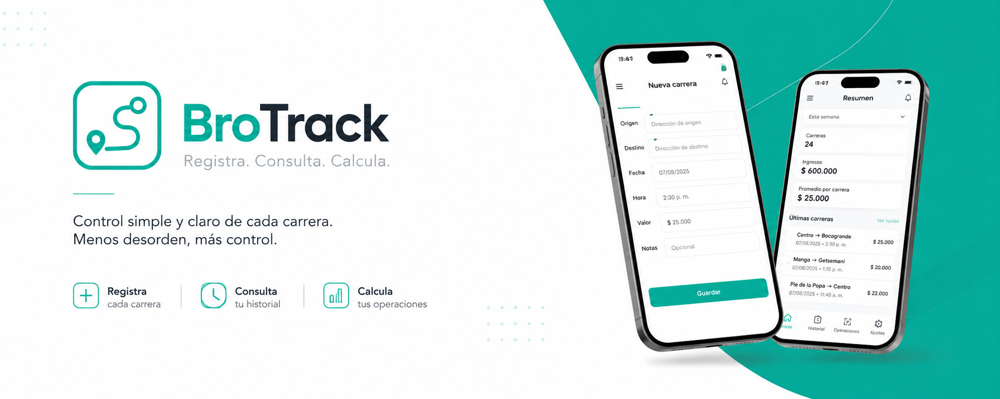

# BROTRACK

  

  Aplicación web de solo uso personal para registrar, consultar y realizar operaciones sobre las carreras realizadas durante mi jornada laboral.

---

## Sobre el proyecto

**BroTrack** es una aplicación web funcional de uso personal desarrollada para organizar las carreras que me realiza mi hermano cuando trabajo en **Imperio Motos**.

La idea del proyecto es sencilla: disponer de un sistema donde pueda registrar cada carrera, consultar posteriormente el historial y realizar operaciones a partir de la información almacenada.

BroTrack no pretende ser una plataforma comercial ni un sistema complejo de gestión de transporte. Su objetivo es resolver una necesidad real de uso personal mediante una aplicación sencilla, organizada y práctica.

## Objetivos

- Registrar cada carrera realizada.
- Consultar las carreras almacenadas.
- Mantener un historial organizado.
- Realizar operaciones y cálculos a partir de los registros.
- Facilitar la consulta de información acumulada.
- Mantener una interfaz sencilla y fácil de utilizar.

---

## Funcionalidades

### Registro de carreras

Permite almacenar la información relevante de cada carrera para mantener un registro organizado y consultable.

### Historial

Permite consultar las carreras registradas y revisar la información almacenada anteriormente.

### Operaciones

Permite realizar cálculos y operaciones utilizando los datos registrados en el sistema.

### Persistencia de información

La información será almacenada en una base de datos MySQL para poder conservarla y consultarla posteriormente.

---

## Tecnologías

| Tecnología | Uso |
|---|---|
| HTML5 | Estructura de la interfaz |
| CSS3 | Diseño y estilos |
| Java | Lógica principal de la aplicación |
| MySQL | Base de datos |
| JDBC | Conexión entre Java y MySQL |
| JavaScript | Interacciones y funcionalidades del lado del cliente |
---